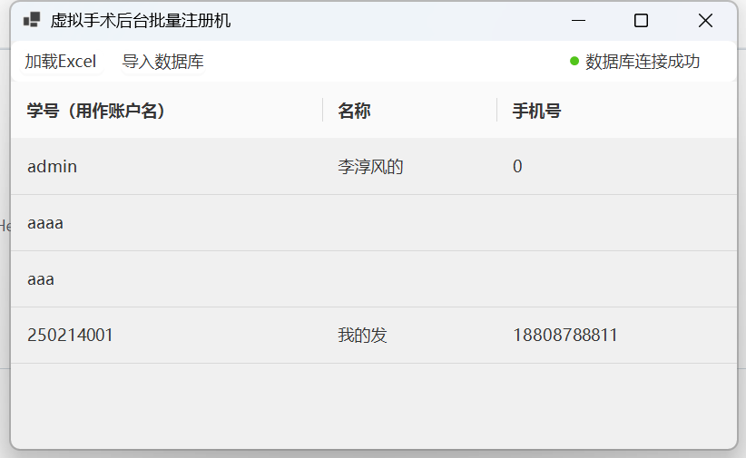
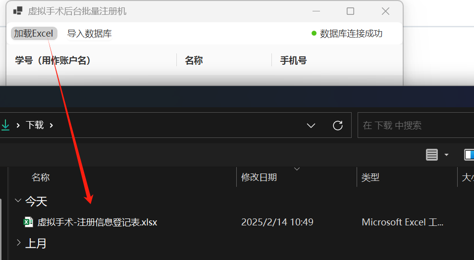
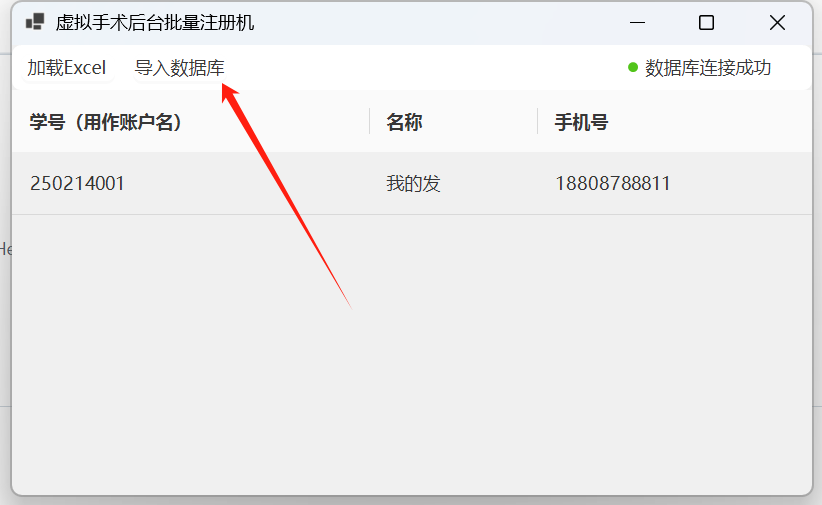
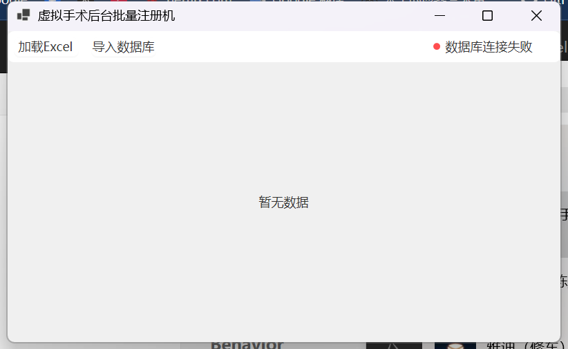

# 虚拟手术后台的批量用户注册器 | VSBatchRegister

### 介绍

虚拟手术项目，直连数据库做的批量注册机，可用于非后台所在电脑，供老师们直接自行进行学生的批量注册。

### 操作流程

##### 配置 

在Resources\Config下，配置config.json，如果没有请创建，字段内容如下

```json
{
  "DB": "Server=127.0.0.1;Port=3306;Database={你的数据库名};User={你的用户名};Password={你的密码};"
}
```

##### 运行

打开项目后会基于配置自动链接数据库，如成功可看到数据库中用户信息



点击加载Excel，可以加载教师汇总手机的注册信息登记表，推荐用腾讯文档提供的收集表导出成本地Excel文件。此时显示数据会切换为从Excel读取到的数据内容。



点击导入数据库，如果成功会有提示



如果遇到错误，无法链接数据库，则右上角状态栏会标红，提示连接失败



### QA：

1. 为啥不直接用腾讯文档的自动化解决	A: 安全问题，内网项目